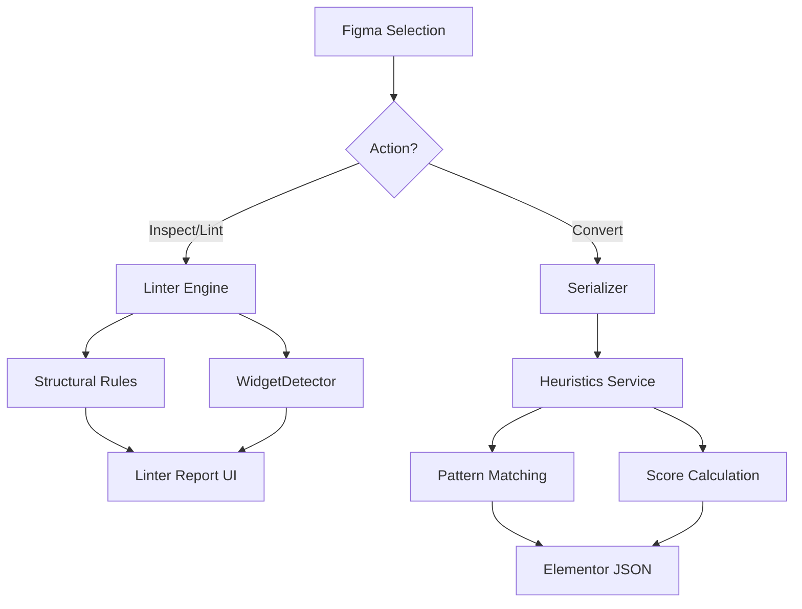
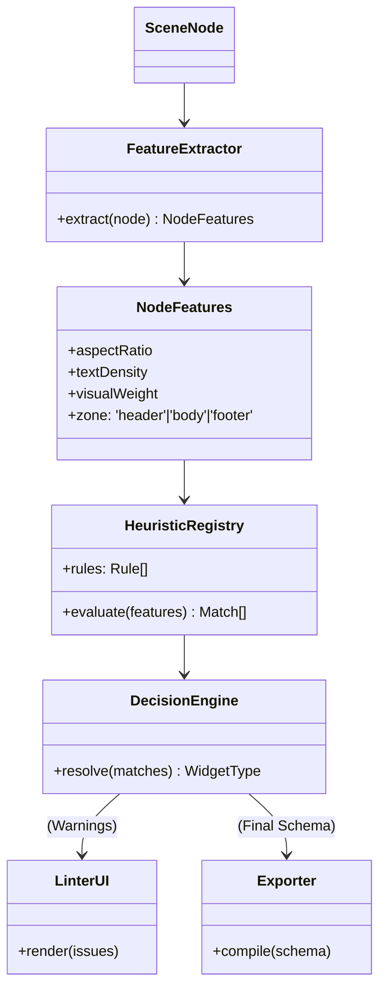

# RFC-001: Modernização do Framework de Lint & Heurísticas

**Status**: Draft  
**Data**: 06/12/2025  
**Autor**: Antigravity Agent (Google Deepmind)  
**Projeto**: Figma → Elementor Compiler  
**Versão Alvo**: 2.0.0

---

## 1. Documentação Oficial (Estado Atual)

### 1.1. Visão Geral da Arquitetura
O atual sistema de análise de layouts opera através de dois motores distintos que funcionam em momentos diferentes do ciclo de vida do plugin. Esta separação, embora funcional, cria a dicotomia "Feedback Visual" vs "Exportação Estrutural".

#### 1.1.1. Engine de Linter (UI-Side)
Responsável pelo feedback em tempo real para o designer.
*   **Ciclo de Vida**: Acionado manualmente ou via seleção de frame.
*   **Pipeline**:
    1.  `SceneNode` → **RuleRegistry** (Carrega regras ativas).
    2.  **Structural Validation**: Verifica Auto Layout, Spacers, Naming Conventions.
    3.  **WidgetDetector (Probabilístico)**: Tenta "adivinhar" o que cada elemento é.
    4.  **UI Feedback**: Gera JSON com erros e warnings renderizados no painel lateral.
*   **Limitação**: O feedback dado aqui *não* afeta diretamente o código gerado na exportação, servindo apenas como "guia".

#### 1.1.2. Pipeline de Exportação "No-AI" (Compiler-Side)
Responsável pela geração silenciosa do JSON Elementor quando a IA está desligada.
*   **Ciclo de Vida**: Acionado ao clicar em "Convert to Elementor".
*   **Pipeline**:
    1.  `SceneNode` → `serializeNode`.
    2.  `analyzeTreeWithHeuristics` (Serviço duplicado).
    3.  `calculateWidgetScore` (Lógica duplicada do WidgetDetector).
    4.  **Widget Schema Generation**: Decide o tipo final do widget.
*   **Risco Crítico**: O algoritmo de pontuação em `noai.parser.ts` é uma cópia divergente da lógica em `WidgetDetector.ts`. Correções em um não refletem no outro.

### 1.2. Fluxo de Dados e Decisão


---

## 2. Diagnóstico & Problemas

### 2.1. Análise de Ruído e Precisão
| Componente | Problema Identificado | Impacto |
|:--- |:--- |:--- |
| **Widget Detector** | "Alucinação" de Widgets (ex: Identificar `Frame` como `Price Table` só por ter texto "Price") | Baixa confiança do usuário; Sugestões irrelevantes. |
| **Structural Lint** | Severidade "Critical" usada excessivamente (ex: Falta de Auto Layout em ícones vetoriais) | Fadiga de alertas; Usuário ignora warnings reais. |
| **Context Awareness** | Ignora posição na página (Header vs Footer) | Impossível distinguir `Nav Menu` topo de `Legal Links` rodapé. |
| **Pipeline Duplicado** | Linter e Exportador usam códigos separados | O plugin "mente": diz que vai gerar X, mas gera Y. |

### 2.2. Problemas de UX
*   **Scroll Infinito**: Lista de issues cresce linearmente com o tamanho do frame.
*   **Falta de Categorização**: Erros de Naming misturados com erros de Layout.
*   **Ação de Correção**: O usuário precisa corrigir manualmente e re-rodar o lint; falta de correção automática ("Quick Fix").

---

## 3. Plano de Modernização (RFC)

### 3.1. Objetivos Técnicos
1.  **Single Source of Truth**: Unificar a lógica de detecção de widgets em um único módulo `WidgetEngine`.
2.  **Context-Aware**: Introduzir "Zonas de Página" (Header, Body, Footer, Sidebar) para refinar pesos probabilísticos.
3.  **Redução de Ruído**: Implementar "Confidence Thresholds" dinâmicos e agrupar erros repetitivos.

### 3.2. Estratégia de Unificação
Vamos extrair toda a lógica de `calculateWidgetScore` (do parser) e `matcher` (do detector atual) para uma nova arquitetura de **Features & Resolvers**.

*   **Feature Extraction**: Extrai características puras (tem imagem? tem texto? aspect ratio?).
*   **Heuristic Evaluation**: Aplica regras baseadas nas features.
*   **Resolution Strategy**: Decide o vencedor com base no Score + Contexto.

### 3.3. Introdução de Contexto (Zones)
O sistema passará a dividir o Frame raiz em zonas lógicas baseadas em coordenadas Y relativas:
*   `ZONE_HEADER`: Top 0-150px (Alta prob. de Nav, Logo, Search).
*   `ZONE_HERO`: Top 150-800px (Alta prob. de Heading H1, Button CTA, Image).
*   `ZONE_BODY`: Middle (Content, Posts, Grid).
*   `ZONE_FOOTER`: Bottom 300px (Copyright, Social Icons, Links).

Esta simples heurística geoespacial elimina ~40% das falsas detecções de navegação e rodapé.

---

## 4. Nova Arquitetura Consolidada

### 4.1. Diagrama de Módulos (Target: v2.0)



### 4.2. Definição da Nova API (`src/engine`)

**Interface Unificada de Resultado:**
```typescript
interface AnalysisResult {
  nodeId: string;
  bestMatch: {
    widget: string;
    confidence: number; // 0.0 - 1.0
    reason: string[];
  };
  alternatives: Array<{ widget: string; confidence: number }>;
  structuralIssues: Array<{
    severity: 'critical' | 'warning' | 'info';
    message: string;
    fixAvailable: boolean;
  }>;
}
```

---

## 5. Design Document: Nova UX do Linter

A nova interface do painel Linter será reestruturada para focar em **Ação** e **Visibilidade**.

### 5.1. Estrutura do Painel
```text
+--------------------------------------------------+
|  LINTER REPORT                      [Re-Scan ⟳]  |
+--------------------------------------------------+
|  [ 92 ]  Health Score (Grade A)                  |
|  🟢 0 Errors   🟡 3 Warnings   🔵 5 Infos       |
+--------------------------------------------------+
|  🔍 Quick Filters:                               |
|  [All] [Structure] [Naming] [Widgets]            |
+--------------------------------------------------+
|                                                  |
|  ▼ 🟡 STRUCTURE (2)                              |
|    • Frame "Hero" missing Auto Layout            |
|      [Fix: Apply Auto Layout]                    |
|    • Nested Groups detected (2x)                 |
|                                                  |
|  ▼ 🔵 SUGGESTIONS (3)                            |
|    • "Retângulo 1" looks like a [Button] (95%)   |
|      [Rename to w:button] [Ignore]               |
|    • "Frame 3" looks like [Icon Box] (80%)       |
|                                                  |
|  ▼ 🟢 NAMING (Passed)                            |
|    All layers properly named.                    |
|                                                  |
+--------------------------------------------------+
|  [ Auto-Fix All Safe Issues ]    [ Export Code ] |
+--------------------------------------------------+
```

### 5.2. Melhorias de Usabilidade
1.  **Agrupamento Collapsible**: Erros agrupados por categoria (Estrutura, Design System, Semântica) iniciam colapsados se forem baixa severidade.
2.  **Ações Rápidas (In-line Action)**: Botão "Fix" direto no item da lista para problemas determinísticos (ex: Renomear, Converter Group->Frame).
3.  **Score Visual**: Um "Health Score" (0-100) gamifica a limpeza do arquivo.
4.  **Ignorar Falsos Positivos**: O usuário pode marcar "Ignore this rule for this node", persistindo a decisão no `pluginData`.

---

## 6. Checklist de Implementação

### Fase 1: Fundação (Core Engine)
- [ ] Criar diretório `src/engine` para a nova arquitetura unificada.
- [ ] Implementar `FeatureExtractor` (extrair lógica de `detectors/WidgetDetector.ts`).
- [ ] Implementar `ZoneDetector` (nova lógica Y-axis).
- [ ] Migrar regras do `noai.parser.ts` para `HeuristicRegistry`.

### Fase 2: Refatoração & Limpeza
- [ ] Remover código duplicado de `src/linter/detectors` e `src/services/heuristics`.
- [ ] Atualizar `analyzeFigmaLayout` para usar o novo `DecisionEngine`.
- [ ] Criar testes unitários comparando resultados da v1 vs v2.

### Fase 3: UX & UI Modernas
- [ ] Reescrever componente de rendenização do Linter em `ui.html` para suportar Collapsibles.
- [ ] Implementar cálculo de "Health Score".
- [ ] Adicionar botões de "Quick Fix" (comunicação bidirecional UI -> Code).
- [ ] Adicionar filtros de categoria na UI.

### Fase 4: Integração Final
- [ ] Conectar Pipeline de Exportação ao novo `DecisionEngine`.
- [ ] Validar exportação "No-AI" com datasets de teste complexos.
- [ ] Atualizar documentação de ajuda do plugin.

---

O objetivo deste plano é transformar o Linter de uma ferramenta passiva de aviso para um assistente ativo de correção, garantindo que o que o usuário "vê" no diagnóstico é exatamente o que ele "recebe" no Elementor.
