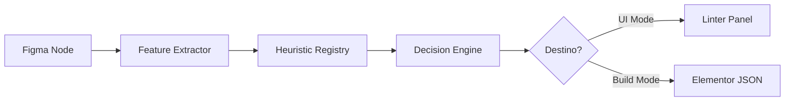

# Documentação Técnica: Framework de Lint & Heurísticas (Figma → Elementor)

**Última Atualização:** 06/12/2025
**Baseado na RFC:** RFC-001

---

## 1. Resumo Executivo
O Framework de Lint & Heurísticas é o "cérebro" por trás da conversão do Figma para Elementor. Ele atua como um tradutor inteligente que analisa elementos visuais (retângulos, textos, grupos) e deduz sua função semântica (Botões, Menus, Seções).

A modernização deste framework visa resolver a discrepância entre o que o designer vê no painel de diagnóstico (Linter) e o código final gerado (Exportador). Com a nova arquitetura unificada, eliminamos a "alucinação" de widgets, reduzimos o ruído de alertas irrelevantes e introduzimos "consciência de contexto" (saber a diferença entre um link no rodapé e um link no menu), garantindo uma exportação mais fiel e previsível.

---

## 2. Visão Geral da Arquitetura
O sistema opera sob uma arquitetura de pipeline unificado, onde a mesma lógica de decisão alimenta tanto o feedback visual na UI quanto o gerador de código.

### Fluxo de Alto Nível

### Módulos Principais

1.  **FeatureExtractor**: Analisa o nó "cru" do Figma e extrai metadados normalizados.
    *   *Input*: `SceneNode` (API complexa do Figma)
    *   *Output*: `NodeFeatures` (Objeto leve com `hasImage`, `textDensity`, `aspectRatio`).
2.  **HeuristicRegistry**: Coleção de regras de detecção.
    *   Contém padrões como `isButtonLike`, `isPricingTableLike`.
    *   Cada regra retorna um *Match* com um *Score* (0.0 a 1.0).
3.  **DecisionEngine**: O árbitro final.
    *   Recebe múltiplos Matches (ex: "Parece Botão (0.8)" e "Parece Card (0.4)").
    *   Aplica pesos baseados em contexto (Zona da Página).
    *   Resolve conflitos e decide o vencedor.
4.  **Exporter / LinterUI**: Consumidores do resultado.
    *   O Exporter usa o vencedor para gerar o JSON.
    *   A UI usa a lista completa para mostrar avisos e alternativas.

---

## 3. Fluxo de Dados

A transformação dos dados segue um pipeline estrito para garantir determinismo:

1.  **Ingestão (`SceneNode`)**:
    *   Recebemos um objeto `FRAME` do Figma com coordenadas absolutas e estilos misturados.
2.  **Normalização (`NodeFeatures`)**:
    *   Convertido para um objeto plano.
    *   Calculamos propriedades derivadas: `isSquare` (aspect ratio ~1), `hasDropShadow`, `childTextCount`.
    *   *Exemplo*: Um retângulo azul com texto branco vira `{ type: 'FRAME', hasFill: true, textCount: 1, ... }`.
3.  **Avaliação (`Match[]`)**:
    *   Regras competem.
    *   Regra "Botão": "Tem fill? Sim. Tem pouco texto? Sim. Score: 0.9".
    *   Regra "Input": "Tem borda? Não. Score: 0.1".
4.  **Resolução (`AnalysisResult`)**:
    *   O `DecisionEngine` elege "Botão".
    *   Gera estrutura final: `{ widget: 'button', confidence: 0.9, issues: [] }`.

---

## 4. Heurísticas e Scores

O sistema utiliza pontuação ponderada para classificar elementos. A confiança (Confidence) é calculada somando sinais positivos e subtraindo sinais negativos.

### Exemplos de Heurísticas

#### **Botão CTA (`w:button`)**
*   **Sinais Positivos (+)**:
    *   Possui Background Color (Solid) ou Borda.
    *   Texto curto (1-3 palavras).
    *   Alinhamento centralizado (Auto Layout Center).
*   **Sinais Negativos (-)**:
    *   Muitos filhos (> 3).
    *   Tamanho muito grande (> 400px de largura).
*   **Score Típico**: 0.85 - 0.95.

#### **Image Box (`w:image-box`)**
*   **Sinais Positivos (+)**:
    *   Contém exatamente 1 Imagem e 1-2 blocos de Texto.
    *   Estrutura vertical.
*   **Fallback**: Se tiver 3+ textos, o score cai e pode perder para "Generic Card" ou "Container".

#### **Heading (`w:heading`)**
*   **Sinais Positivos (+)**:
    *   Fonte grande (> 24px).
    *   Peso da fonte (Bold/Black).
    *   Texto curto (não é parágrafo).

### Cálculo de Confiança
`Confidence = Clamp((BaseScore + ContentBoost + VisualBoost - Penalty), 0, 1)`

---

## 5. Context Awareness (Zonas de Página)

Para reduzir falsos positivos, o `FeatureExtractor` agora anota a **Zona Vertical** do elemento baseada na posição Y relativa ao frame raiz.

| Zona | Range (aprox) | Peso em Heurísticas |
| :--- | :--- | :--- |
| **HEADER** | 0px - 150px | Favorece: `Nav Menu`, `Logo`, `Search`, `Icon`. Penaliza: `Footer Copyright`. |
| **HERO** | 150px - 800px | Favorece: `Heading H1`, `CTA Button`, `Hero Image`. |
| **BODY** | > 800px | Neutro. Favorece: `Grid`, `Post`, `Gallery`. |
| **FOOTER** | Bottom 300px | Favorece: `Social Icons`, `Legal Text`, `List`. Penaliza: `Hero`. |

*Exemplo*: Um grupo de links no topo da página ganha boost para ser `Nav Menu`. O mesmo grupo no rodapé ganha boost para ser `Social Icons` ou `Footer Links`.

---

## 6. Linter UI (Interface de Diagnóstico)

O painel de Linter consome o `AnalysisResult` e o apresenta de forma acionável.

*   **Agrupamento**: Erros não são mais lista plana. São agrupados por:
    1.  **Estrutura Crítica**: Falhas que quebram o layout (ex: Falta de Auto Layout).
    2.  **Sugestões Semânticas**: Oportunidades de melhoria (ex: "Isso parece um botão, quer renomear?").
    3.  **Boas Práticas**: Avisos de acessibilidade ou nomenclatura.
*   **Severidade Dinâmica**:
    *   🔴 **Critical**: Impede exportação correta.
    *   🟡 **Warning**: Exporta, mas pode ter glitch visual.
    *   🔵 **Info**: Apenas sugestão.

---

## 7. Pipeline de Exportação "No-AI"

A exportação utiliza a **mesma engine** do Linter. Isso garante consistência: se o Linter diz que é um botão, o exportador gera um botão.

*   **Mode Build**: Ao rodar a exportação, o `AnalysisResult` é usado para decidir a tag HTML/JSON final.
*   **Fallback**: Se a confiança do melhor match for baixa (< 0.5), o exportador recorre a elementos genéricos (`Container`, `Text`, `Image`) para evitar quebrar o layout com widgets errados.

---

## 8. Limitações e Riscos

1.  **Dependência de Auto Layout**: O sistema funciona 80% melhor em arquivos que usam Auto Layout corretamente. Arquivos com posicionamento absoluto e "Groups" ainda geram muitos alertas de estrutura.
2.  **Ambiguidade Visual**: Um "Card" e um "Botão Grande" podem ser visualmente idênticos. O sistema tenta desempatar pelo conteúdo (botões têm verbos, cards têm descrições), mas falhas ocorrem.
3.  **Nested Frames**: Estruturas muito aninhadas (Frame > Frame > Frame > Text) diluem a análise. O novo `FeatureExtractor` tenta "olhar através" de frames transparentes para mitigar isso.

---

## 9. Trabalhos Futuros

*   **Integração com LLM (Opcional)**: Usar IA apenas para desempatar casos de baixa confiança (Score 0.4 - 0.6).
*   **Detecção de Padrões Repetidos**: Identificar que uma sequência de 3 cards idênticos forma uma "Grid" ou "Loop" automaticamente.
*   **Quick Fix em Lote**: Botão "Aplicar Auto Layout em todos os Frames filhos".
