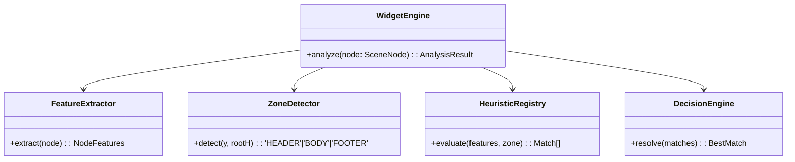

# 2. Especificação Técnica: Lint Engine V2

**Status**: RFC Approved  
**Target**: `src/engine`

---

## 1. Arquitetura Atual vs Nova

### Diagnóstico (V1)
A arquitetura atual processa a árvore de nós duas vezes usando lógicas divergentes:
*   `Linter`: *Heurística Permissiva* (UI Thread). Foca em dar feedback rápido, mas impreciso.
*   `Parser`: *Heurística Rígida* (Main Thread). Foca em segurança de tipo, muitas vezes "emburrecendo" a exportação para garantir HTML válido.

### Objetivo (V2)
Implementar uma arquitetura de **Single Source of Truth (SSOT)**.
Um único pipeline de processamento (`WidgetEngine`) deve rodar tanto na requisição de Lint quanto na de Exportação.

---

## 2. Componentes Principais

### Class Diagram

### 2.1. FeatureExtractor
Abstrai a complexidade do `SceneNode` do Figma em um objeto leve e normalizado.
*   **Responsabilidade**: Performance e Normalização.
*   **Input**: `SceneNode` (com mixins complexos).
*   **Output**: `NodeSnapshot` (POJO - Plain Old Java Object).
    *   `textDensity`: (0-1) Quanto de área é texto.
    *   `visualGroup`: Boolean. Se é um container visual (Frame com fill/stroke).

### 2.2. ZoneDetector
Adiciona contexto espacial para desempatar heurísticas.
*   **Lógica**:
    *   `HEADER`: 0 - 150px (Alta prob: Nav, Logo).
    *   `HERO`: 150 - 800px (Alta prob: H1, CTA).
    *   `BODY`: > 800px.
    *   `FOOTER`: Bottom 300px (Alta prob: Links, Copyright).

### 2.3. HeuristicRegistry
Coleção de regras puras e isoladas.
*   **Contrato**: `(features: NodeFeatures, zone: Zone) => Score (0.0 - 1.0)`
*   **Exemplo**:
    *   `RuleButton`: Ganha pontos se tiver Fill e Texto Curto. Perde pontos se for muito grande (>400px).
    *   `RuleInput`: Ganha pontos se tiver Stroke e Placeholder text ("Digite aqui...").

### 2.4. DecisionEngine
O juiz da competição.
*   **Thresholds**:
    *   `> 0.8`: **Confident** (Sugere Auto-Fix).
    *   `0.5 - 0.79`: **Probable** (Sugere semântica, mas requer user review).
    *   `< 0.5`: **Fallback** (Trata como Container genérico).
*   **Conflitos**: Se `Button (0.7)` vs `Card (0.7)`, prefere o container maior (`Card`) ou o mais genérico.

---

## 3. Fluxos de Dados

### 3.1. Fluxo de Linter (UI Feedback)
1.  Usuário seleciona Frame.
2.  UI solicita `runLint(nodes)`.
3.  `WidgetEngine` processa e retorna lista de `Issues` e `Suggestions`.
4.  UI agrupa por categoria e exibe Health Score.

### 3.2. Fluxo de Exportação (No-AI)
1.  Usuário clica "Export to Elementor".
2.  UI solicita `buildJson(nodes)`.
3.  `WidgetEngine` processa e retorna o `BestMatch` para cada nó.
4.  Exportador converte o `BestMatch` para o Widget JSON do Elementor correspondente.
