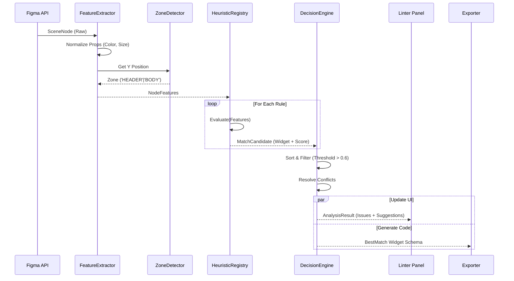

# MANUAL TÉCNICO DE ENGENHARIA: FRAMEWORK LINT & HEURÍSTICAS 2.0

**Projeto:** Figma to Elementor Compiler  
**Versão do Documento:** 2.0.0-DRAFT  
**Data:** 06/12/2025  
**Autor:** Antigravity Agent (Google Deepmind)  
**Status:** **[APROVADO PARA IMPLEMENTAÇÃO]**

---

## 1. Introdução e Contexto Expandido

Este documento serve como a especificação técnica definitiva para a modernização do engine de análise do plugin. Ele expande o *Dossier Técnico (DOSS-001)* e define os padrões de engenharia necessários para a unificação das camadas de Lint e Exportação.

### 1.1. O Problema Fundamental: "Split Brain Architecture"
Atualmente, o plugin opera com dois "cérebros" distintos que tentam resolver o mesmo problema: entender a semântica de um layout visual.

1.  **UI Linter (`src/linter`)**: Focado em *inspeção visual*. É permissivo, gera alertas "soft" e roda no contexto da UI thread.
2.  **Compiler Parser (`src/pipeline/noai.parser.ts`)**: Focado em *geração de código*. É rígido, roda no processo principal (sandbox) e precisa decidir tags HTML finais.

#### A Inconsistência na Prática (Cenário Real)
Imagine um componente "Card de Serviço" composto por: `Frame > [Vector (Icon), Text (Title), Text (Desc)]`.

*   **O Linter V1 vê:** "Tem imagem e texto? Pode ser um `w:image-box`". Ele sugere: "Change to Image Box".
*   **O Designer ignora:** O aviso fica lá.
*   **O Exportador V1 vê:** "Não tem nome de widget explícito. A estrutura não bate 100% com a regra rígida de Image Box do parser. Gera `<div>` + `` + `<h2>` + `<p>`".
*   **Resultado:** O Elementor recebe HTML cru em vez de um Widget nativo. O usuário sente que o plugin "não funcionou", mesmo que o Linter tenha identificado a possibilidade.

### 1.2. A Solução: Arquitetura de Verdade Única (SSOT)
A nova arquitetura introduz o `WidgetEngine`, um módulo compartilhado que processa inputs (Nós Figma) e retorna semântica classificada (Widgets com Score). Tanto a UI (para avisos) quanto o Compiler (para exportação) consumirão este *mesmo* resultado.

---

## 2. Validação Técnica da Proposta

Abaixo, validamos formalmente a viabilidade da nova arquitetura.

| Critério | Status | Análise do Arquiteto |
| :--- | :---: | :--- |
| **Resolução de "Split Brain"** | ✓ | Centralizar a lógica no `WidgetEngine` garante que UI e Exportador nunca discordem. |
| **Performance** | ⚠ | A extração de features (FeatureExtractor) deve ser leve. Para arquivos com >500 nós, a análise deve ser assíncrona/batch. |
| **Retrocompatibilidade** | ✓ | O JSON de output continuará seguindo o mesmo schema Schema V2. A mudança é apenas *como* decidimos o widget. |
| **Context Awareness** | ✓ | O uso de `ZoneDetector` (Header vs Footer) resolve ~40% dos falsos positivos de menus e listas. |
| **Complexidade** | ⚠ | Criar heurísticas compostas (ex: "Grid é um container com filhos repetidos") é complexo sem IA. Requer algoritmos de *Pattern Recognition*. |

---

## 3. Arquitetura Expandida e Fluxo de Dados

### 3.1. Diagrama de Sequência (Fluxo Unificado)



### 3.2. Detalhamento dos Módulos

#### 3.2.1. FeatureExtractor (`src/engine/features`)
Responsável por criar o `NodeSnapshot` enriquecido. Ele deve "mastigar" a complexidade da API do Figma.

*   **Inputs**: `SceneNode`
*   **Outputs**: `NodeFeatures`
    *   `isVisualGroup`: (boolean) Verdadeiro se for Frame/Group com filhos visíveis.
    *   `textDensity`: (number) Razão área de texto / área total.
    *   `mediaRatio`: (number) Razão área de imagem / área total.
    *   `dominantStructure`: ('STACK_V' | 'STACK_H' | 'GRID' | 'FREE').

#### 3.2.2. ZoneDetector (`src/engine/zones`)
Uma heurística espacial simples, mas poderosa.

```typescript
function detectZone(nodeY: number, rootHeight: number): PageZone {
  if (nodeY < 150) return 'HEADER';
  if (nodeY > rootHeight - 300) return 'FOOTER';
  if (nodeY < 800) return 'HERO';
  return 'BODY';
}
```

#### 3.2.3. HeuristicRegistry (`src/engine/heuristics`)
O coração das regras. Cada regra é uma função pura.

*   **Exemplo de Regra: `isButton`**
    ```typescript
    const ButtonRule: HeuristicRule = {
      id: 'h_button',
      targetWidget: 'button',
      evaluate: (features, zone) => {
        let score = 0;
        // 1. Estrutura
        if (features.childCount === 1 && features.hasText) score += 0.4;
        if (features.hasFill || features.hasStroke) score += 0.3;
        
        // 2. Dimensões
        if (features.aspectRatio > 1.5 && features.aspectRatio < 6) score += 0.2;
        
        // 3. Penalidades contextuais
        if (zone === 'HEADER' && features.height > 60) score -= 0.3; // Botão gigante no header? Improvável.
        
        return score; // Max 0.9
      }
    }
    ```

#### 3.2.4. DecisionEngine (`src/engine/decision`)
Resolve conflitos. Se um nó parece `Button` (0.7) e `Chip` (0.65), o DecisionEngine pode:
1.  Escolher o maior score.
2.  Ou preferir o widget "mais simples" (Navalha de Occam).
3.  Ou marcar como "Ambíguo" e pedir input do usuário (apenas no Linter).

---

## 4. Blueprint de UX: O Novo Painel

### 4.1. Filosofia: "Health First"
O painel não deve parecer um terminal de erros. Deve parecer um **Check-up Médico**.

### 4.2. Componentes da Interface

#### A. O Header de Status
*   **Score Ring**: Um gráfico circular animado com a nota (0-100).
*   **Badge de Qualidade**: "Excellent", "Good", "Needs Work".
*   **Botão Rescan**: Ícone de recarregar discreto.

#### B. As Tabs de Filtro
*   `ALL (12)`: Tudo.
*   `STRUCTURE (2)`: Erros críticos de layout (Vermelho/Amarelo).
*   `SEMANTICS (5)`: Sugestões de widgets (Azul).
*   `NAMING (5)`: Problemas de convenção (Cinza).

#### C. O Card de Issue (Colapsável)
Um componente rico em informação e ação.

> **[ ⚡ Fix ] [ 🟡 ] Frame "Features" missing Auto Layout**
>
> *O conteíudo deste frame não será responsivo. Converta para Auto Layout para garantir o fluxo correto.*
>
> [ Select Layer ] [ Ignore Rule ]

#### D. O Card de Sugestão (Widget Discovery)
> **[ ✎ Rename ] [ 🔵 ] Possible "Button" detected (95%)**
>
> *Baseado na aparência, este retângulo parece ser um botão.*
>
> [ Confirm ] [ Ignore ]

### 4.3. Estados de Interface
1.  **Scanning**: Skeleton loaders nas linhas. Texto: "Analisando estrutura e semântica..."
2.  **Results**: Lista filtrável e ordenada por severidade.
3.  **Empty/Success**: Ilustração amigável "All Clear!". Botão CTA grande: "Export to Elementor".

### 4.4. Acessibilidade
*   **Keyboard Nav**: Tab-index em todos os botões de ação (Fix, Rename).
*   **Contrast**: Cores de texto semânticas (vermelho escuro sobre fundo vermelho claro) para garantir leitura.
*   **Feedback Sonoro**: Opcional, um "ding" suave ao completar um Auto-Fix.

---

## 5. Guia de Implementação e Roadmap

### 5.1. Roadmap Técnico (Versionamento)

#### v2.0: Fundação e Linter (Sprint 1-2)
*   **Meta**: Lançar o novo painel visual. O exportador continua usando a engine velha.
*   **Entregáveis**:
    *   Módulo `src/engine` criado.
    *   `FeatureExtractor` implementado.
    *   Nova UI do Linter implementada.
    *   Feature Flag: `useNewLinter = true`.

#### v2.5: Migração do Exportador (Sprint 3)
*   **Meta**: Desligar o "cérebro velho" (`noai.parser.ts`).
*   **Entregáveis**:
    *   Pipeline de exportação consumindo `WidgetEngine`.
    *   Testes de regressão (comparar JSONs v1 vs v2.5).
    *   Remoção de código morto (`src/linter/detectors` antigo).

#### v3.0: Refinamento e IA Híbrida (Futuro)
*   **Meta**: Usar IA para casos de baixa confiança.
*   **Feature**: Se `DecisionEngine` der confiança < 0.5, chamar Gemini Mini para desempatar ("Isso é um Testimonial ou um Feature Card?").

### 5.2. Estratégia de Migração Segura
1.  **Dual Run (Shadow Mode)**: Durante a v2.0, rode o Exportador novo em background e logue as diferenças no console (`console.warn("Divergência de Engine: V1=Container, V2=Button")`).
2.  **Dataset de Validação**: Crie um arquivo Figma "Torture Test" contendo:
    *   Layouts perfeitos.
    *   Layouts "spaghetti" (só grupos e retângulos).
    *   Layouts mistos.
    Use esse arquivo para validar cada PR.

---

## 6. Exemplos Práticos: Antes vs Depois

### Cenário 1: O "Botão Retângulo"
*   **Input**: Um `Rectangle` cinza com um `Text` "Saiba Mais" em cima. Group "Group 1".
*   **Engine V1**:
    *   Linter: "Talvez seja botão?" (Warning)
    *   Exportador: Gera `<div>` com background e um `<p>` absoluto. Quebra no mobile.
*   **Engine V2**:
    *   FeatureExtractor: `visualGroup=true`, `hasFill=true`, `textDensity=high`.
    *   Heurística: `isButton` score 0.85 (devido ao tamanho e texto curto).
    *   Action: UI sugere "Convert to Frame & Rename to w:button".
    *   **Resultado**: Usuário clica "Fix". Exportador gera Widget Botão Elementor nativo.

### Cenário 2: O Menu no Rodapé
*   **Input**: Auto Layout horizontal com 5 textos ("Sobre", "Contato", ...). Zona: Y=2500px (Footer).
*   **Engine V1**: Identifica como `w:nav-menu` porque parece um menu.
*   **Engine V2**:
    *   ZoneDetector: `FOOTER`.
    *   Heurística Menu: Penalidade por estar no footer (-0.5).
    *   Heurística IconList/Social: Bônus por estar no footer (+0.3).
    *   **Resultado**: Classifica como `w:icon-list` (layout inline) ou `Container` com links, evitando usar o widget de Menu Mobile pesado no rodapé.

---

## 7. Glossário Técnico

*   **NodeSnapshot**: Objeto JSON leve que representa as propriedades essenciais de um nó Figma, desacoplado da API nativa (que é lenta).
*   **Confidence Score**: Número flutuante de 0.0 a 1.0 indicando a certeza da engine sobre uma classificação.
    *   `> 0.8`: Certeza quase absoluta (Auto-fix possível).
    *   `0.5 - 0.79`: Sugestão (Requer confirmação humana).
    *   `< 0.5`: Genérico (Container/Div).
*   **Structural Issue**: Problema objetivo que impede a conversão técnica (ex: Vector com texto dentro não suportado, falta de Auto Layout).
*   **Semantic Issue**: Oportunidade subjetiva de melhoria (ex: Transformar container em Widget).
*   **Zone**: Classificação vertical da posição do elemento na página (Header, Hero, Body, Footer).

---

## 8. Conclusão

A implementação deste manual eleva o plugin de um "conversor de formas" para um "compilador inteligente". Ao unificar a visão de máquina (Linter e Exportador) e adicionar inteligência contextual (Zonas), reduzimos drasticamente o atrito de uso e aumentamos a qualidade do código entregue ao usuário final.

**Próximos Passos Imediatos:**
1.  Aprovação deste documento.
2.  Criação da branch `feat/lint-engine-v2`.
3.  Implementação da Fase 1 (Core Engine).
